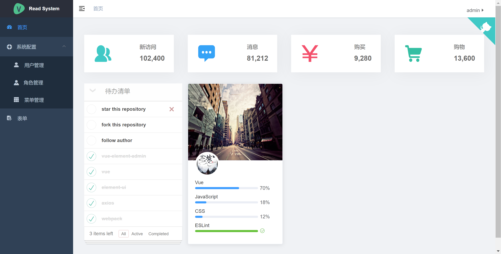

# 通用的后台管理系统

## 后端

* Spring Boot
* Spring Security
* Jwt
* MyBatis Plus
* Redis
* Mysql
* Flyway

## 前端

* [前端](https://github.com/shuaiwu1108/ws-book-front)

## 移动端
* [移动端](https://github.com/shuaiwu1108/ws-book-front-app)

## 实现的功能

* 用户管理、角色管理、菜单管理、权限管理

## 页面

